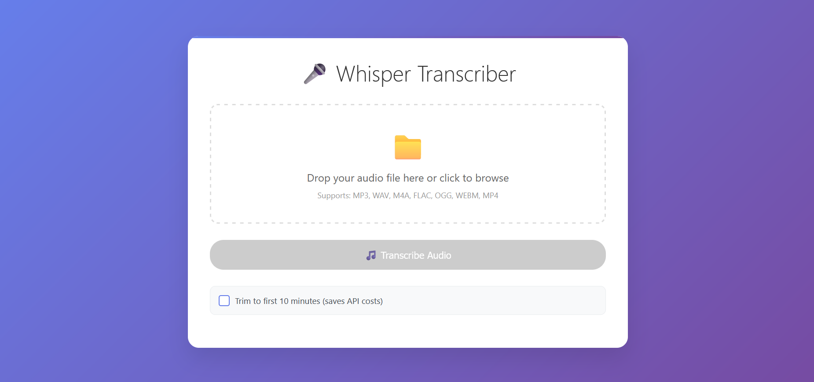

<div align="center">

# 🎤 Whisper Transcriber Web App



[](https://www.python.org/downloads/)
[](https://flask.palletsprojects.com/)
[](https://openai.com/whisper)
[](LICENSE)

**A modern web application for transcribing audio files using OpenAI's Whisper API**

[](http://localhost:5000)
[](#features)
[](#supported-audio-formats)

---

**🎵 Convert your audio files to text with AI-powered transcription**  
**🌐 Beautiful web interface accessible from any device**  
**⚡ Fast, secure, and optimized for large files**

---

</div>

A modern web application for transcribing audio files using OpenAI's Whisper API. This application provides a beautiful, responsive web interface that replaces the original tkinter GUI.

## Features

- 🎤 **Audio Transcription**: Convert audio files to text using OpenAI's Whisper API
- 🌐 **Web Interface**: Modern, responsive web UI accessible from any browser
- 📁 **Drag & Drop**: Easy file upload with drag and drop support
- 📱 **Mobile Friendly**: Responsive design that works on all devices
- 💾 **Download Transcripts**: Save transcription results as text files
- 🔒 **Secure**: File validation and secure handling
- ⚡ **Fast**: Optimized for quick transcription processing
- ✂️ **Audio Trimming**: Option to trim audio to first 10 minutes to save API costs
- 🗜️ **Smart Compression**: Automatically compresses large files to meet Whisper's 25MB limit
- 📦 **Intelligent Chunking**: Splits very large files into manageable chunks for processing

## Supported Audio Formats

- MP3
- WAV
- M4A
- FLAC
- OGG
- WEBM
- MP4

## Prerequisites

- Python 3.7 or higher
- OpenAI API key

## Installation

1. **Clone or download the project files**

2. **Install dependencies**:
   ```bash
   pip install -r requirements.txt
   ```

3. **Set up your OpenAI API key**:
   ```bash
   export OPENAI_API_KEY="your-api-key-here"
   ```
   
   Or create a `.env` file in the project directory:
   ```
   OPENAI_API_KEY=your-api-key-here
   ```

## Usage

1. **Start the web server**:
   ```bash
   python web_app.py
   ```

2. **Open your browser** and navigate to:
   ```
   http://localhost:5000
   ```

3. **Upload an audio file**:
   - Click the upload area to browse for files
   - Or drag and drop an audio file directly onto the upload area
   - **File size limit**: Up to 100MB (automatically optimized for Whisper's 25MB limit)

4. **Transcribe**:
   - Click the "Transcribe Audio" button
   - Wait for the transcription to complete
   - View the results in the transcript area

5. **Audio Trimming** (Optional):
   - Check "Trim to first 10 minutes" to save API costs
   - Useful for long audio files where you only need the beginning
   - Automatically converts trimmed audio to WAV format for optimal processing

6. **File Optimization** (Automatic):
   - **Compression**: Large files are automatically compressed to MP3 format
   - **Chunking**: Very large files are split into 10-minute chunks
   - **Quality Optimization**: Audio is optimized for Whisper (16kHz, mono)
   - **Smart Processing**: Only applies optimization when needed

7. **Download**:
   - Click "Download Transcript" to save the transcription as a text file
   - Use "Clear" to start over with a new file

## File Structure

```
transcriber/
├── web_app.py          # Main Flask application
├── requirements.txt    # Python dependencies
├── templates/
│   └── index.html     # Web interface template
├── uploads/           # Temporary file storage (created automatically)
└── README.md          # This file
```

## Configuration

The application can be configured by setting environment variables:

- `OPENAI_API_KEY`: Your OpenAI API key (required)
- `SECRET_KEY`: Flask secret key (optional, defaults to development key)
- `MAX_CONTENT_LENGTH`: Maximum file upload size (default: 50MB)

## Security Features

- File type validation
- Secure filename handling
- Automatic cleanup of uploaded files
- Maximum file size limits
- Input sanitization

## Troubleshooting

### Common Issues

1. **"OpenAI API key not configured"**
   - Make sure you've set the `OPENAI_API_KEY` environment variable
   - Or create a `.env` file with your API key

2. **"Invalid file type"**
   - Ensure you're uploading a supported audio format
   - Check that the file extension is correct

3. **"File too large"**
   - The maximum file size is 100MB
   - Files are automatically compressed and chunked if needed
   - Consider using the trim option for very long files

4. **"Transcription fails"**
   - Check your internet connection
   - Verify your OpenAI API key is valid and has sufficient credits
   - Ensure the audio file is not corrupted
   - Large files may take longer to process due to compression/chunking

### Getting Help

If you encounter issues:
1. Check the browser's developer console for error messages
2. Verify your OpenAI API key is working
3. Try with a smaller audio file first

## Development

To run in development mode:
```bash
python web_app.py
```

The application will run on `http://localhost:5000` with debug mode enabled.

## Production Deployment

For production deployment:

1. Set a proper `SECRET_KEY`
2. Use a production WSGI server (e.g., Gunicorn)
3. Configure proper logging
4. Set up HTTPS
5. Consider using a reverse proxy (e.g., Nginx)

Example with Gunicorn:
```bash
pip install gunicorn
gunicorn -w 4 -b 0.0.0.0:5000 web_app:app
```

## License

This project is open source and available under the MIT License.

## Contributing

Contributions are welcome! Please feel free to submit a Pull Request. 